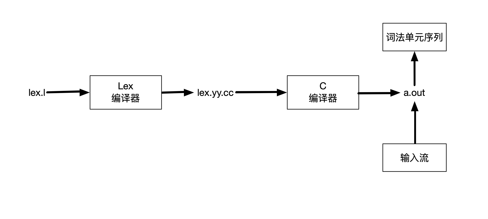

# Cool

This repo contains my study resources from CS143.

Cool is a tiny compiler.

Enjoy it and have fun.


Notes
-----


Lex
----
----

Lex是一个工具，它支持使用正则表达式来描述各个词法单元的模式，通过Lex可以很简单的给出一个词法分析器的规约。



一个Lex程序具有下列的形式

```
声明部分
%%
转换规则
%%
辅助函数
```

* 声明部分
声明部分包括常量和明示变量(manifest constant),如果Lex跟Yacc一起使用的话，那么明示变量通常会在Yacc程序中定义，并在Lex程序中不加定义就使用它们。

* 转换规则
转换规则具有下列的格式: `模式 {动作}`
每一个模式是一个正则表达式，它可以使用声明部分中给出的正则定义，动作部分是代码片段，会被直接拷贝到`lex.yy.cc`里面去的。

* 辅助函数
可有可无。


1. 从`/include/PA2/cool-parse.h`文件中，我们可以看到Tokens的类型，也就是lex的各种返回值。

```C
#define CLASS 258
#define ELSE 259
#define FI 260
#define IF 261
#define IN 262
#define INHERITS 263
#define LET 264
#define LOOP 265
#define POOL 266
#define THEN 267
#define WHILE 268
#define CASE 269
#define ESAC 270
#define OF 271
#define DARROW 272
#define NEW 273
#define ISVOID 274
#define STR_CONST 275
#define INT_CONST 276
#define BOOL_CONST 277
#define TYPEID 278
#define OBJECTID 279
#define ASSIGN 280
#define NOT 281
#define LE 282
#define ERROR 283
#define LET_STMT 285
```

2. 一共有三个符号表，分别存id和int以及string.
```C
IdTable idtable;
IntTable inttable;
StrTable stringtable;
```
它们都是继承`StringTable`基类，因此它们的接口都是一样，都是通过`add_string`来添加element，用`lookup_string`来查找。

因此，我们Lab2的任务已经比较清晰，就是通过扫描文件，返回Token对应的数值，并将该Token加入到符号表里面去，一些关键字就不需要加了，因为会出现多次且不会引发歧义。


